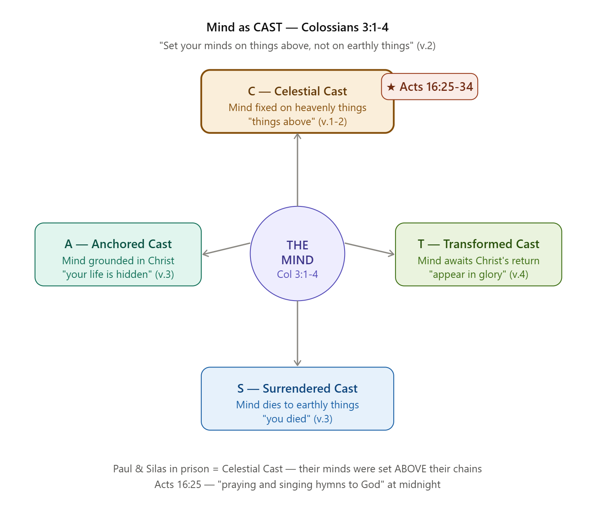
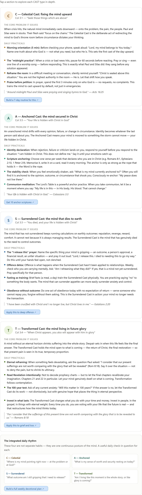

## Who Was Paul?

Paul and Silas ministered together on the second missionary journey, which spans Acts 15 through 18. Before any of that, Paul — originally Saul of Tarsus — was a trained Pharisee and a fierce persecutor of Christians, until a blinding encounter with the risen Christ on the road to Damascus completely reversed his life. He became the apostle to the Gentiles, and by the time Acts 16 arrives, he had already survived stonings, shipwrecks, and rejection in city after city.

---

## Who Was Silas?

The Jerusalem church chose Silas as their official representative. He was not an unknown figure — Silas is called a "prophet" who said much to encourage and strengthen the believers in Antioch. He carried real spiritual authority and credibility in the early church. Peter's first epistle regards Silas as a "faithful brother," and he co-authored letters to the Thessalonians with Paul.

---

## How Did They Meet and Why Did Paul Choose Him?

Before their missionary travels together, Paul and Silas traveled together on a different mission — carrying the Jerusalem Council's ruling to Antioch to correct false teaching about circumcision. Paul and Silas likely built their friendship on this journey.

Then came the famous split. Paul and Barnabas disagreed sharply over John Mark — who had left them earlier — initiating two separate missionary journeys. Barnabas took John Mark to Cyprus. Paul took a man named Silas and travelled through Syria and Cilicia. Paul did not pick Silas by accident. He chose a man he had already proven in the field, a man of prophetic gifting, courage, and loyalty.

---

## The Journey to Philippi — Everything That Led to the Prison

Paul and Silas started by traveling northwestward through the region of Cilicia, then into Galatia, where they picked up Timothy at Lystra. The Holy Spirit prevented them from preaching in the province of Asia. Then coming to the borders of Mysia, they headed north for Bithynia, but again the Spirit of Jesus did not allow them to go there. So they went to Troas, where Paul had a vision: a man from Macedonia was pleading, "Come over and help us!"

This is a critical detail — they did not arrive in Philippi by their own plan. The Holy Spirit repeatedly redirected them until they crossed into Europe.

In Philippi, Paul and Silas met a slave girl who was demon possessed. Her owners made money off her ability to tell fortunes. She followed Paul and Silas for many days. Paul cast the demon out of her. The girl's owners, realizing they would make no more money from her, took Paul and Silas to the magistrates.

A mob quickly formed against Paul and Silas. The city officials ordered them stripped and beaten with wooden rods. They were severely beaten and thrown into prison. The jailer was ordered to make sure they didn't escape, so he put them into the inner dungeon and clamped their feet in the stocks.

---

## What Makes This Moment So Theologically Significant

Understand what Paul and Silas had been through *before* midnight:

- They came to Philippi not by their own will but by direct divine guidance
- They did an act of mercy — freeing a girl from demonic bondage
- They were rewarded for that act with a public beating, humiliation, and imprisonment
- They had committed no crime — and as Roman citizens, their rights had been grossly violated
- They sat in the *inner* dungeon, the most secure and darkest cell, with feet in stocks

And yet — around midnight Paul and Silas were praying and singing hymns to God, and the other prisoners were listening.

This is the moment where the **Celestial Cast** of the mind becomes visible. Not theological theory — living proof. Their minds were not locked in that dungeon. Their minds were already in another place entirely. And because of that, heaven came down.

That is the foundation on which the teaching of **Mind as CAST** from Colossians 3:1-4 stands.

## The CAST Framework from Colossians 3:1-4

**C — Celestial Cast** means the mind is directed upward, toward heaven, toward Christ who is seated at the right hand of God (v.1). This is not escapism — it is a conscious, deliberate orientation of thought toward eternal realities over temporal ones.

**A — Anchored Cast** means the mind is secured *in* Christ. Verse 3 says "your life is hidden with Christ in God." No matter the circumstances, identity and security are rooted in a place no enemy can reach.

**S — Surrendered Cast** means the mind has died to the pull of earthly things. "You died" (v.3) — the mind no longer takes its cues from flesh, fear, or circumstance as its primary reference point.

**T — Transformed Cast** means the mind is oriented toward future glory — the return of Christ (v.4). It holds a living hope that reframes present suffering.

---

## Acts 16:25-34 — What Type of Cast is This?

Paul and Silas at midnight in a Philippian prison — beaten, bound in stocks — choosing to pray and sing hymns to God. This is the **Celestial Cast** in pure action.

Their minds were not cast *downward* onto their chains, their wounds, or their injustice. Their minds were cast **upward** — onto God. The result? Heaven responded. An earthquake shook the foundations, chains fell, doors opened, and the jailer and his entire household came to salvation.

The Celestial Cast is the most powerful demonstration here: **when the mind is set on things above, the earthly situation is not ignored — it is overwhelmed from above.**

What Paul and Silas modeled was not denial of suffering. It was a mind so anchored in the Celestial that the prison could not contain the atmosphere they carried.

